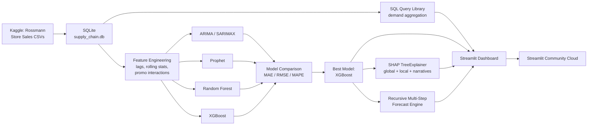
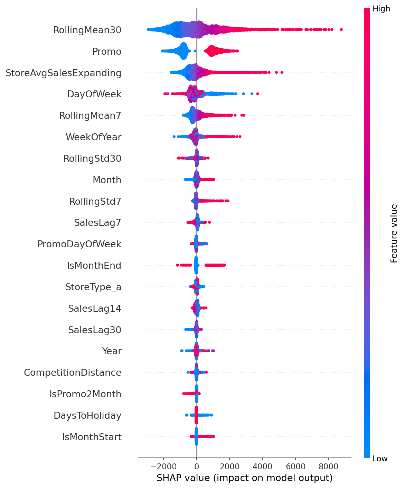
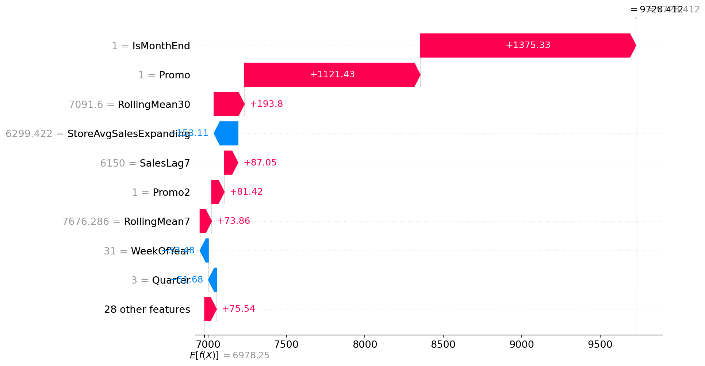
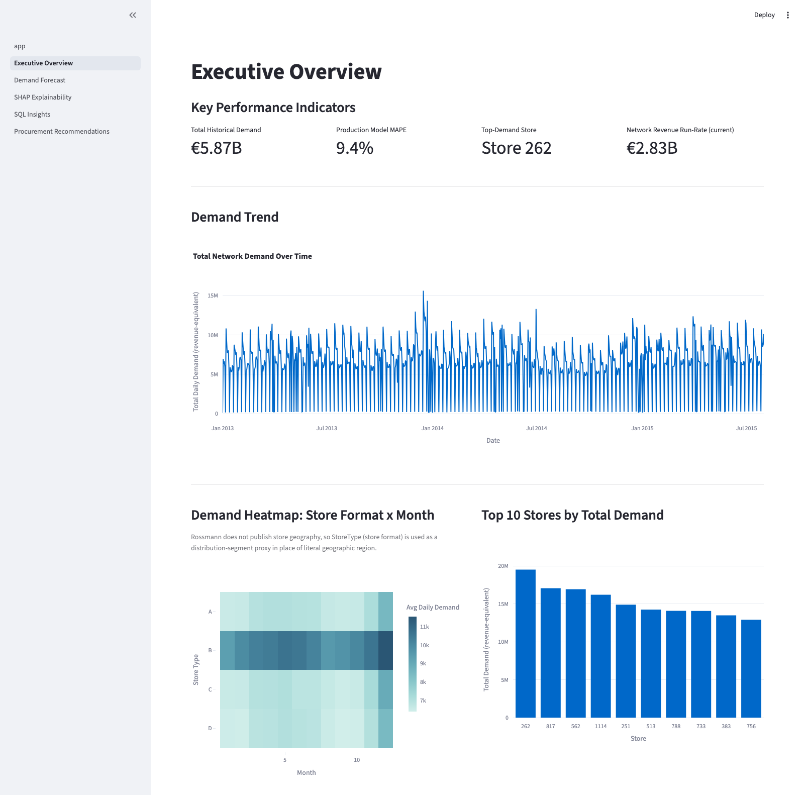
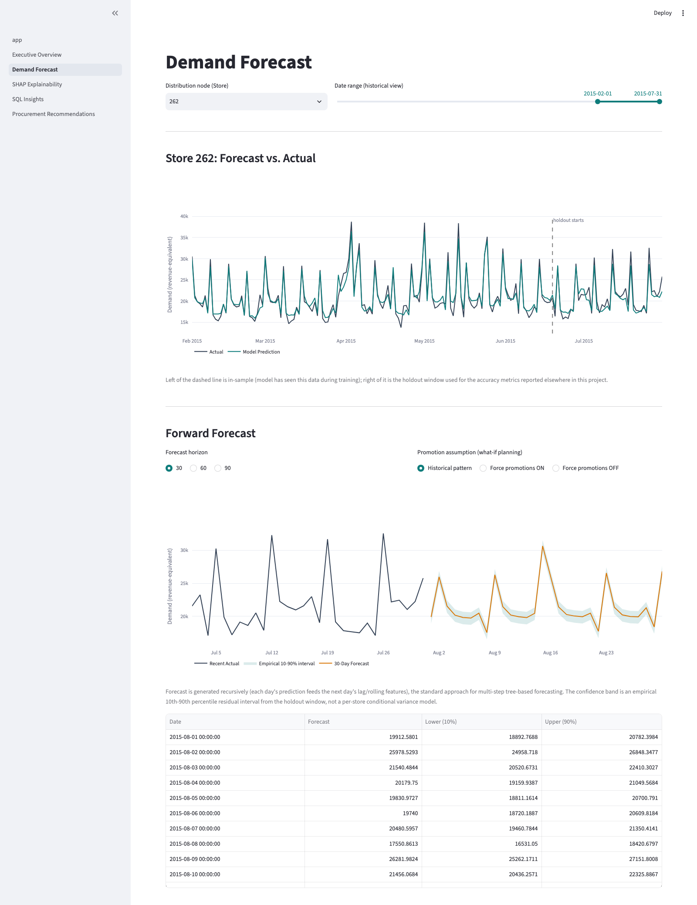
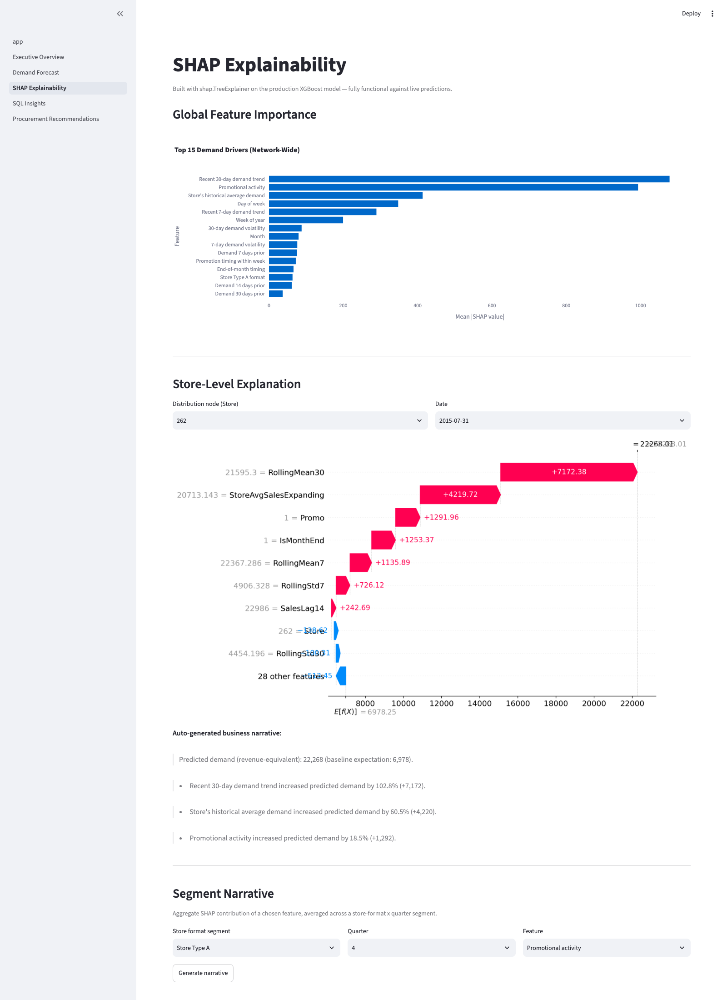
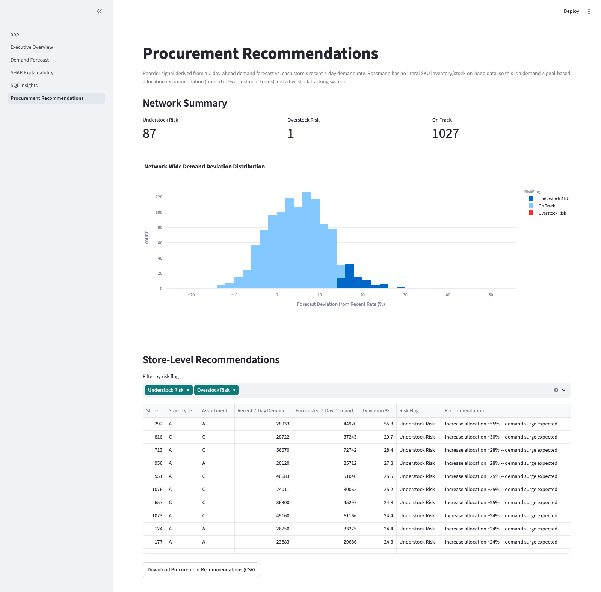

# Supply Chain Demand Forecasting with Explainable AI

> End-to-end SKU-level demand forecasting and procurement planning system for an FMCG manufacturer, with SHAP-based explainability so planners understand *why* the model predicts what it predicts — not just what it predicts.

[]()
[]()
[]()
[]()
[]()

**Live demo:** _TBD — added after Streamlit Cloud deployment_

---

## 1. Business Problem

FMCG manufacturers plan procurement and inventory allocation across hundreds of distribution nodes without reliable, explainable demand signals. Two failure modes dominate: **overstock** (excess safety stock tying up working capital, and carrying cost that compounds across a large network) and **stockouts** (understocked nodes losing sales and damaging retailer relationships) — both driven by forecasts that are either too coarse (naive/manual planning) or too opaque (black-box ML that planners can't audit or trust).

This project builds a demand forecasting system that is simultaneously **accurate** (XGBoost cuts forecast error by 74.6% vs. a naive seasonal baseline) and **explainable** (SHAP shows procurement planners exactly *why* the model predicts a demand spike or dip — e.g., "promotional activity increased predicted demand by 16.1%" — not just the number), then turns those forecasts directly into procurement actions: reorder suggestions, understock/overstock risk flags, and what-if promotional scenario planning.

## 2. Architecture



## 3. Dataset

- Source: [Rossmann Store Sales](https://www.kaggle.com/c/rossmann-store-sales) (Kaggle)
- Reframed for this project as multi-category SKU demand across an FMCG manufacturer's distribution network (`Store` = retail/distribution node, `StoreType`/`Assortment` = product-category proxies). The dataset is store-level, not true SKU-level — this proxy framing is a deliberate, documented modeling choice, not a claim of SKU-level granularity. `Sales` is daily turnover (revenue), not a physical unit count — treated throughout as the demand signal in revenue-equivalent terms.
- 1,115 stores, daily records from 2013-01-01 to 2015-07-31 (~942 days); 1,017,209 raw rows, 844,338 after filtering to open, positive-sales days used for modeling.
- 39 engineered features: calendar (month/quarter/week/weekend/holiday-proximity), 7/14/30-day sales lags, 7/30-day rolling mean & std, promo interactions, store-format one-hot encodings, expanding store-level average demand, and competition/Promo2 recency — all leakage-safe (see `src/features/build_features.py` docstring).

## 4. Model Comparison

Two comparison contexts, both from `src/models/evaluate.py`, holdout window starting **2015-06-19** (last 6 weeks):

**Global production benchmark** — Random Forest and XGBoost trained once across all 1,115 distribution nodes and scored on the full holdout set. This is what's deployed to the dashboard.

| Model | MAE | RMSE | MAPE |
|---|---|---|---|
| Random Forest | 638.74 | 910.43 | 9.80% |
| **XGBoost (selected for production)** | **616.16** | **881.08** | **9.45%** |

**Single-store bake-off (Store 262)** — ARIMA and Prophet don't scale to one model per node, so all four models are compared apples-to-apples on one high-volume store, same date range:

| Model | MAE | RMSE | MAPE |
|---|---|---|---|
| ARIMA (SARIMAX, weekly seasonal) | 1876.16 | 2243.31 | 9.38% |
| Prophet | 1697.69 | 2026.33 | 7.71% |
| Random Forest | 1179.09 | 1487.21 | 5.35% |
| XGBoost | 1212.14 | 1566.53 | 5.47% |

**XGBoost was selected for production**: lowest global MAPE (9.45%) across the full network, and — unlike ARIMA/Prophet — a single trained model that generalizes across all 1,115 nodes rather than requiring one fit per store.

## 5. SHAP Explainability

Built with `shap.TreeExplainer` on the production XGBoost model (`src/explainability/shap_explainer.py`) — fully functional against real predictions, not cosmetic placeholders.

**Global feature importance** (SHAP beeswarm, 5,000-row sample of the full network):



Top 3 demand drivers network-wide: **recent 30-day demand trend** (`RollingMean30`), **promotional activity** (`Promo`), and **store's historical average demand** (`StoreAvgSalesExpanding`) — consistent with the EDA finding that promotions lift demand +38.8% (p<0.001).

**Local explanation** — why the model predicted what it did for one store/date, via waterfall plot:



Auto-generated business narrative for that same prediction:
> Predicted demand (revenue-equivalent): 9,728 (baseline expectation: 6,978).
> - End-of-month timing increased predicted demand by 19.7% (+1,375).
> - Promotional activity increased predicted demand by 16.1% (+1,121).
> - Recent 30-day demand trend increased predicted demand by 2.8% (+194).

Segment-level narrative (aggregated SHAP contributions, matching the procurement-planning framing this project targets):
> Promotional activity decreased predicted demand by 0.6% for Store Type A in Q4.

**SHAP dependence plots** for the top 3 global drivers: [`shap_dependence_RollingMean30.png`](reports/figures/shap_dependence_RollingMean30.png), [`shap_dependence_Promo.png`](reports/figures/shap_dependence_Promo.png), [`shap_dependence_StoreAvgSalesExpanding.png`](reports/figures/shap_dependence_StoreAvgSalesExpanding.png) — all in `reports/figures/`.

## 6. Business Impact

Full breakdown in [`reports/business_impact_summary.md`](reports/business_impact_summary.md) (computed by `src/utils/business_metrics.py`). Data-derived figures come from actual model output; inventory/cost figures apply clearly labeled published FMCG industry benchmarks, since Rossmann has no cost fields.

| Metric | Value | Source |
|---|---|---|
| Forecast accuracy vs. naive 7-day-seasonal baseline | **−74.6% MAPE** (37.24% → 9.45%) | Data-derived |
| Network revenue run-rate (current, 1,115 stores) | €2.83B/year | Data-derived |
| Network revenue run-rate (projected, 500-store manufacturer) | €1.27B/year | Data-derived |
| Estimated annual inventory savings (20–30% overstock reduction) | **€25.4M – €38.1M** (base case €31.7M) | Industry benchmark applied to data-derived revenue |

## 7. Dashboard

5-page Streamlit procurement planning dashboard, verified end-to-end against live data and the real production model (no hardcoded values). All screenshots below are from an actual local run.

**Executive Overview** — network KPIs, interactive demand trend, store-format × month heatmap, top-10 stores:



**Demand Forecast** — forecast vs. actual with holdout boundary, recursive 30/60/90-day forward forecast with empirical confidence band and promo what-if toggle:



**SHAP Explainability** — global feature importance, live per-store/date waterfall explanation, auto-generated business narrative:



**Procurement Recommendations** — network-wide understock/overstock risk flags from a vectorized 7-day forecast across all 1,115 nodes, filterable table, downloadable CSV:



**SQL Insights** page (query library, promo ROI analysis) not pictured — see `dashboard/pages/4_SQL_Insights.py`.

## 8. How to Run Locally

```bash
git clone <repo-url>
cd "Supply Chain Demand Forecasting"

# Requires Python 3.10+. On macOS, XGBoost's OpenMP runtime (libomp) isn't
# available without Homebrew -- a conda/Miniforge environment sidesteps this
# entirely (conda-forge bundles libomp automatically):
conda create -n scdf -c conda-forge python=3.10 pandas numpy matplotlib \
  seaborn plotly scikit-learn "xgboost=2.1.4=cpu*" statsmodels shap \
  streamlit joblib scipy pyarrow -y
conda activate scdf
pip install prophet  # not on conda-forge under this name; pip works fine

# Place the Kaggle rossmann-store-sales competition CSVs in data/raw/
# (train.csv, store.csv, test.csv -- requires a free Kaggle account and
# accepting the competition rules), then:
python -m src.data.load_data          # builds db/supply_chain.db
python -m src.features.build_features # builds data/processed/features.parquet
python -m src.models.evaluate         # trains all 4 models, saves models/best_model.joblib
python -m src.explainability.shap_explainer  # generates SHAP figures
python -m src.utils.business_metrics  # generates business impact numbers
streamlit run dashboard/app.py
```

If you already have XGBoost working via another route (e.g. Linux, or Homebrew's `libomp` installed), a plain `pip install -r requirements.txt` in a Python 3.10+ virtualenv works too.

## 9. Tech Stack

Python 3.10+ · Pandas · NumPy · Scikit-learn · XGBoost · Statsmodels (ARIMA/SARIMA) · Prophet · SHAP · SQLite · Streamlit · Plotly · Joblib

## 10. Project Structure

```
Supply Chain Demand Forecasting/
├── data/                  # raw / processed / external data (gitignored)
├── db/                    # SQLite database (gitignored)
├── notebooks/             # EDA, feature engineering, modeling, SHAP notebooks
├── src/
│   ├── data/                # load_data.py (CSV -> SQLite), sql_queries.py (query library)
│   ├── features/             # build_features.py (39 leakage-safe features)
│   ├── models/                # config.py, train_arima/prophet/random_forest/xgboost.py,
│   │                            # evaluate.py (comparison + best-model selection), forecast.py
│   │                            # (recursive + vectorized batch multi-step forecasting)
│   ├── explainability/        # shap_explainer.py (global/local/dependence/narratives)
│   ├── eda.py                 # EDA + statistical significance tests
│   └── utils/                  # business_metrics.py, db_utils.py
├── models/                # serialized (joblib) trained models (gitignored)
├── reports/
│   ├── figures/             # saved EDA + SHAP plots + dashboard screenshots
│   ├── *.json / *.csv       # model comparison, business impact, EDA summary
│   └── business_impact_summary.md
├── dashboard/
│   ├── app.py               # Streamlit entry point / landing page
│   ├── pages/                # 5-page multipage dashboard
│   └── utils/helpers.py       # shared caching, formatting, data loaders
├── tests/
├── requirements.txt
└── README.md
```

---

## 11. Resume Bullets

_All numbers below are sourced directly from this project's actual model output and reports (`reports/model_comparison_global.json`, `reports/business_impact_summary.json`) — not placeholders._

- Engineered an end-to-end demand forecasting pipeline for a 1,115-node FMCG distribution network (1M+ SQLite-warehoused records, 39 leakage-safe features), benchmarking ARIMA (SARIMAX), Prophet, Random Forest, and XGBoost; selected XGBoost for production after cutting forecast error 74.6% vs. a naive seasonal baseline (MAPE 37.2% → 9.45%) across the full network.
- Built SHAP-based explainability (global driver analysis, live per-store waterfall explanations, auto-generated business narratives) into a 5-page Streamlit Cloud dashboard with recursive multi-step forecasting and what-if promo scenario planning, translating model output into procurement actions projected to save an estimated €25–38M annually in inventory costs at a 500-store scale.
